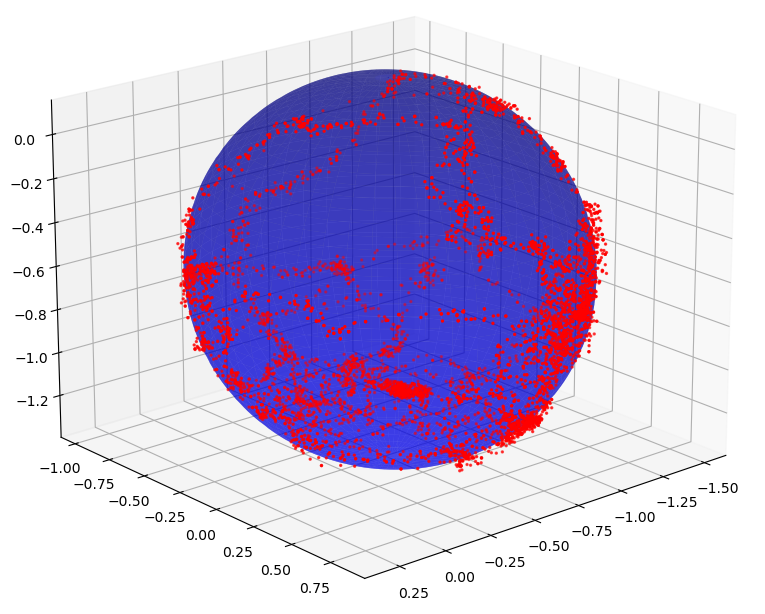

# Magnetometer Calibration using ellipsoid fitting



This package helps calibrating a magnetometer for mobile robotics and embedded systems.

It requires a data set of raw magnetometer measurements. In order for the calibration to be reliable, take care of covering as much directions as possible when collecting the calibration data.

## Get soft-iron matrix and hard-iron offset from calibration data

In order to use the following, your calibration data must be stored either in a .txt or .npz file.

### .txt
The file must contain 3 columns for the measurements along x, y and z, separated by spaces.

### .npz
The file must contain 3 .npy entitled: mag_x, mag_y and mag_z.


### Option 1
Use **mag_cal.sh** in a bash session

Open a terminal

Run this to give execution permission:
```
chmod +x myscript.sh
```

Then, run the shell script with bash, passing as argument your data set path.

For example if my calibration data is stored in *data/mag_data.txt* :
```
./mag_cal.sh data/mag_data.txt
```

### Option 2
Use **mag_cal.py** directly (used by mag_cal.sh)

In a bash session
```
python3 mag_cal.py data/mag_data.txt
```

## More details and visualization

Use **magnetometer_calibration.py** with your data set to get more details about the calibration and visualize ellipse fitting and correction.

Please read [Magnetometer Calibration](magnetometer_calibration.pdf) to learn abour the theory behind hard-iron and soft-iron calibration, and ellipsoid fitting.